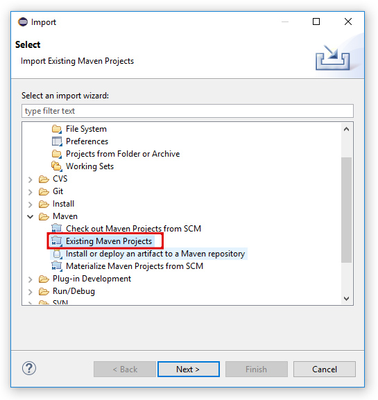

<h1>TP 4</h1>
Le TP a pour objectif de manipuler les données avec JPA et un système de base de données HSQL

<h2>Prerequis pour ce projet </h2>
<ul>
  <li>Avoir une base en programmation Java</li>
  <li>Avoir une base en SQL </li>
  <li>Avoir une base dans les base de données relationnelles</li>
  <li>Un base dans la gestion de dependance avec Maven serait un plus
</ul>

<h2>Technologies utilisées</h2>
<ul>
  <li>JPA</li>
  <li>Pattern DAO</li>
  <li>JAX-RS</li>
</ul>

<h2>Deploiement</h2>
<ol>
  <li>Cloner le projet avec le lien de github</li>
  <li>Impoter le projet cloné en cliquant sur File > Import > Maven > Existing maven project</li>
  
  
  <li>JAX-RS</li>
</ol>

